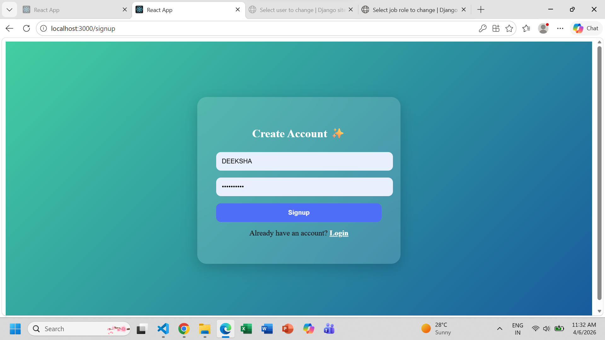
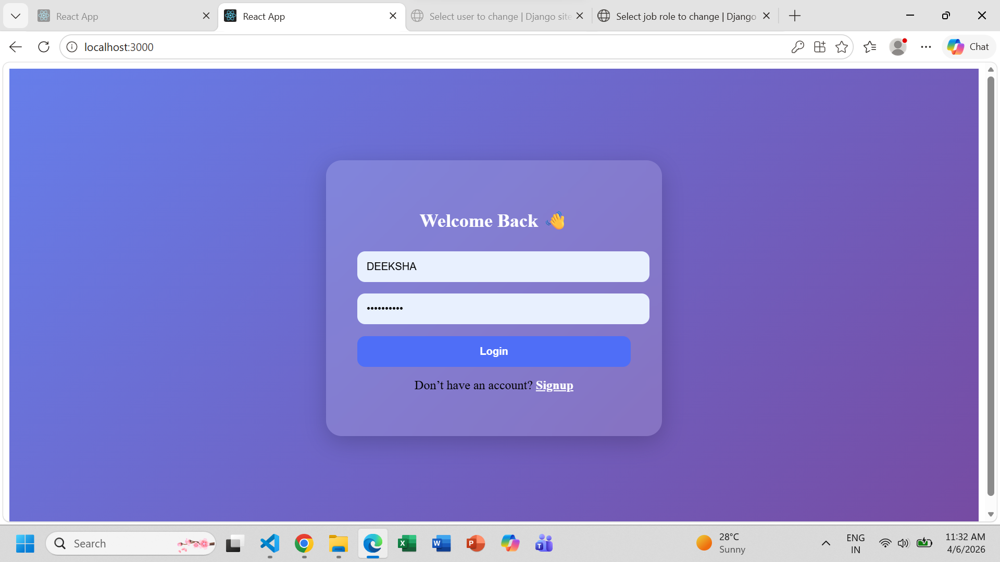
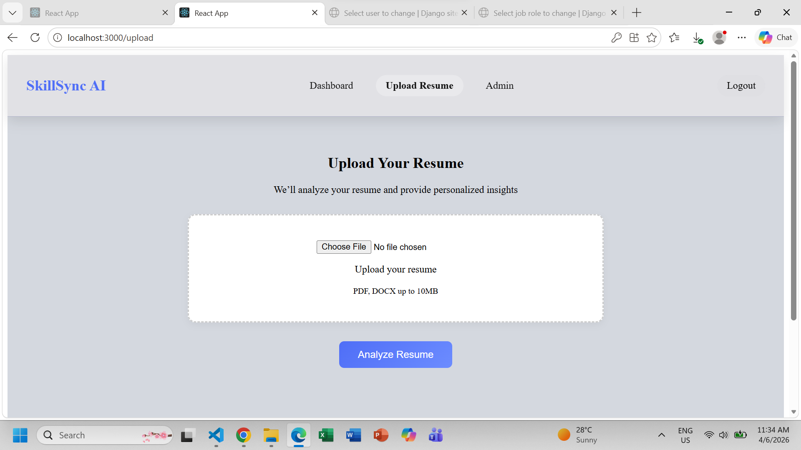
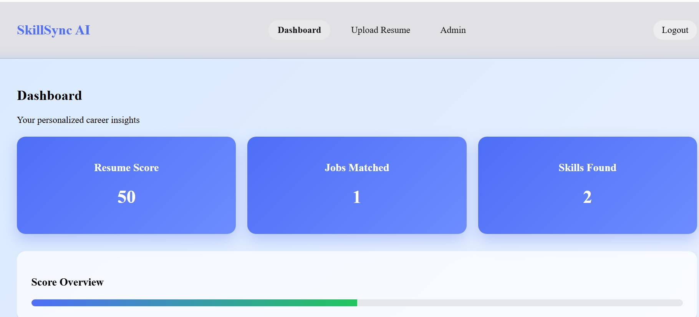
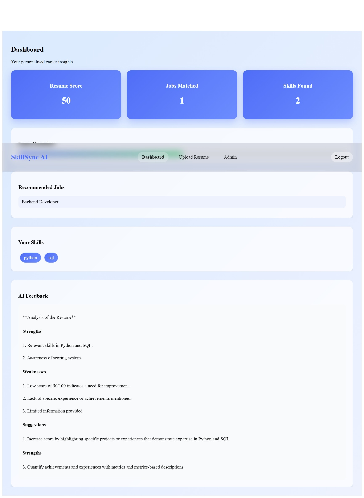
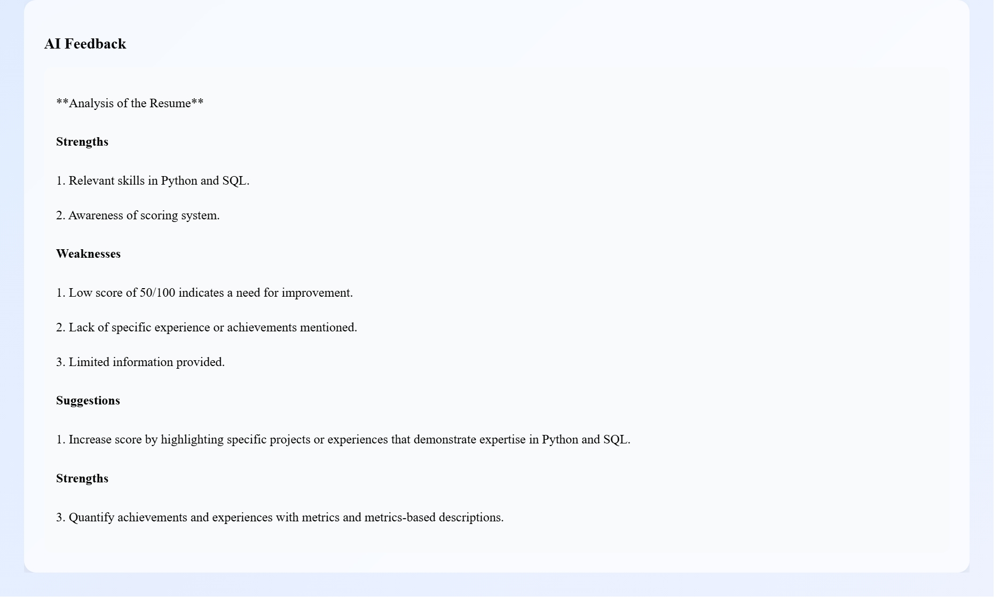

# 🚀 AI Resume Analyzer (SkillSync AI)

An intelligent web application that analyzes resumes, extracts skills, calculates a score, and provides job recommendations along with AI-powered feedback.

---

## 📌 Project Overview

This project helps users understand how well their resume matches industry requirements.

### 💡 Workflow:
1. User signs up / logs in
2. Uploads resume (PDF/DOCX)
3. Backend extracts text
4. Skills are detected
5. Resume score is calculated
6. Job roles are matched
7. AI generates feedback
8. Dashboard displays everything

---

## 🛠️ Tech Stack

### 🔹 Frontend
- React.js
- React Router
- Axios

### 🔹 Backend
- Django
- Django REST Framework (DRF)

### 🔹 AI Integration
- Groq API (LLM for feedback)

### 🔹 Libraries Used
- PyPDF2 → PDF text extraction
- python-docx → DOCX extraction

---

## 📂 Project Structure

```
JOB_AI/
│
├── backend/
│   ├── api/
│   │   ├── views.py        # Resume processing logic
│   │   ├── models.py       # Job roles & skills
│   │   ├── urls.py         # API routes
│   │   ├── admin.py        # Admin panel setup
│   │
│   ├── backend/
│   │   ├── settings.py     # Django settings
│   │   ├── urls.py         # Main routing
│   │
│   ├── manage.py
│
├── frontend/
│   ├── src/
│   │   ├── pages/
│   │   │   ├── Login.js
│   │   │   ├── Signup.js
│   │   │   ├── Upload.js
│   │   │   ├── Dashboard.js
│   │   │   ├── Admin.js
│   │   │
│   │   ├── components/
│   │   │   ├── Navbar.js
│   │   │
│   │   ├── App.js
│
└── README.md
```

---

## ⚙️ Backend Explanation

### 🔹 views.py
Handles:
- Resume upload
- Text extraction (PDF/DOCX)
- Skill extraction
- Score calculation
- Job recommendation
- AI feedback generation

### 🔹 models.py
Stores:
- Job roles
- Required skills

### 🔹 admin.py
Allows admin to:
- Add job roles
- Manage skills

---

## ⚙️ Frontend Explanation

### 🔹 Login & Signup
- User authentication system
- Stores user session in localStorage

### 🔹 Upload Page
- Upload resume
- Sends file to backend API
- Saves response

### 🔹 Dashboard
Displays:
- Resume score
- Skills found
- Jobs matched
- AI feedback

### 🔹 Admin Page
- Add job roles
- Define required skills

---

## 🔗 Frontend–Backend Connection

1. React sends request:
```
POST /api/upload/
```

2. Django processes:
- Extracts text
- Finds skills
- Calculates score

3. Response:
```
{
  "skills": [],
  "score": 50,
  "jobs": [],
  "feedback": ""
}
```

4. Stored in localStorage → Displayed in Dashboard

---

## 📊 Features

- ✅ Resume upload (PDF/DOCX)
- ✅ Skill extraction
- ✅ Resume scoring
- ✅ Job recommendations
- ✅ AI feedback
- ✅ Admin panel
- ✅ Login & Signup system

---

## 📸 Screenshots

### 🔐 Signup Page


### 🔑 Login Page


### 📤 Upload Page


### 📊 Dashboard - Overview


### 📊 Dashboard - Skills & Jobs


### 🤖 AI Feedback


---

## 🔐 Environment Variables

Create `.env` file inside backend:

```
GROQ_API_KEY=your_api_key_here
```

---

## 🚀 Run Locally

### Backend
```
cd backend
python manage.py runserver
```

### Frontend
```
cd frontend
npm install
npm start
```

---

## 🔮 Future Improvements

- JWT Authentication
- Resume auto-improvement suggestions
- Job API integration
- UI enhancements

---

## 🧠 Interview Explanation


> This is an AI-powered resume analyzer built using React and Django. Users upload resumes, the backend extracts skills, calculates a score, recommends jobs, and generates AI feedback. Admin can manage job roles, and the frontend displays all insights dynamically.

---

## 👩‍💻 Author

Deeksha  
Aspiring AI & Full Stack Developer 🚀